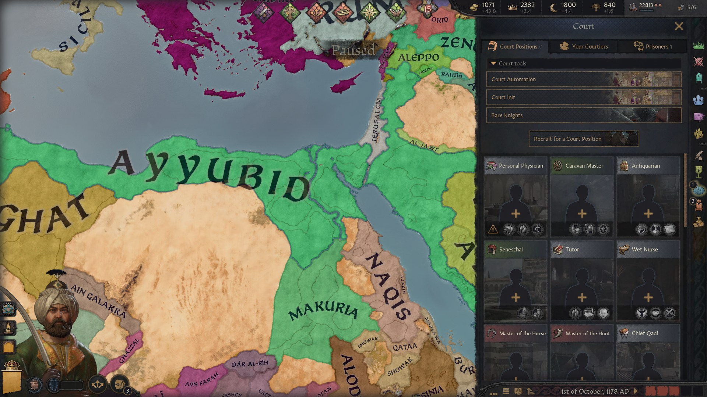
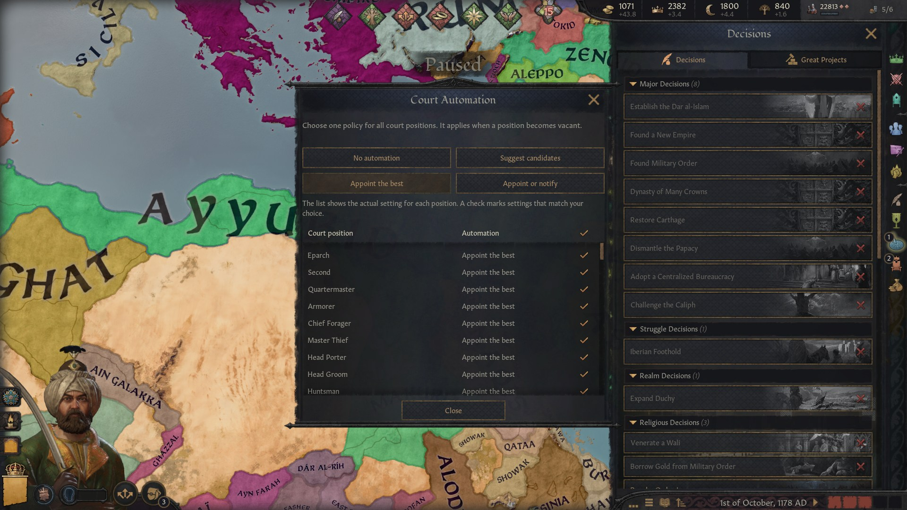
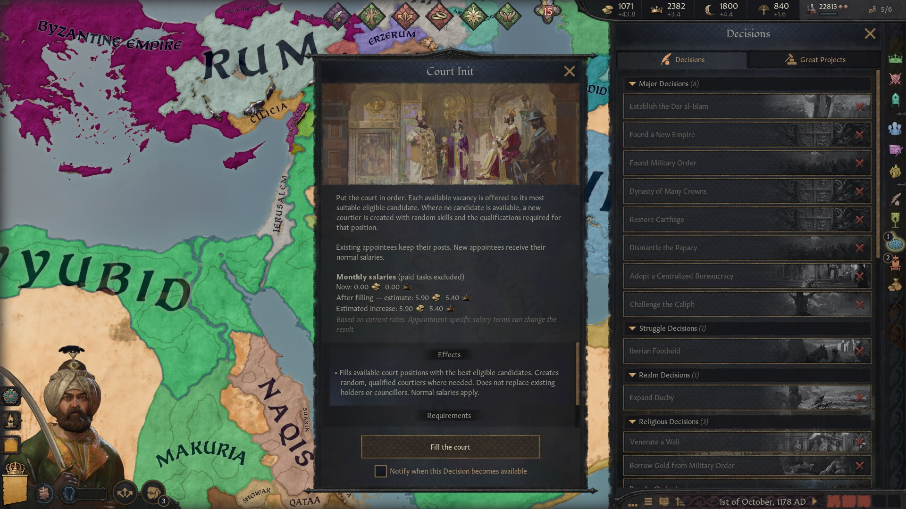
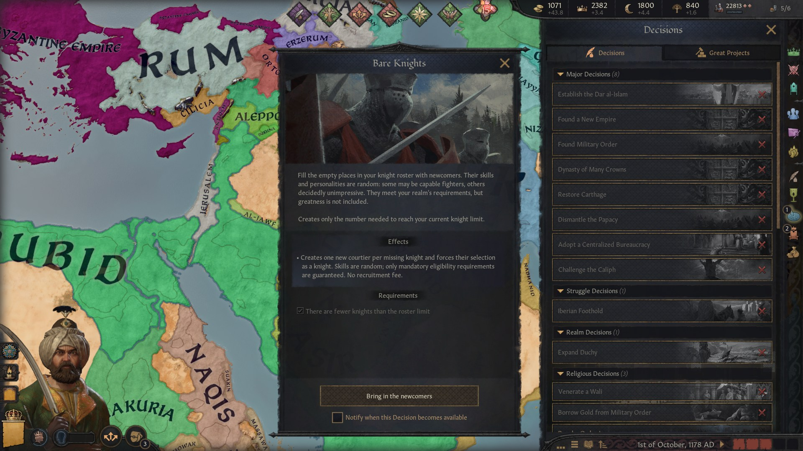

# Court Automation

## At a glance

- 🟢 **Version 0.2.2** · Targets CK3 **1.20.0.4**.
- 🟢 **Standalone:** no other mod required.
- 🟢 One court automation picker, vacant court positions filled on demand, and random knights to fill your roster.
- 🟢 **Languages:** English, French, German, Japanese, Korean, Polish, Russian, Simplified Chinese and Spanish.
- 🟢 Conservative AI assistance is enabled by default and can be disabled with a game rule.
- 🔴 Creates new characters without a recruitment fee. Court positions retain their normal salaries.
- 🔴 Court Init covers vanilla court positions, including available DLC positions. Adventurer camp offices and positions added by other mods are outside its scope.

## A court ready to serve

Choose how future court vacancies should be handled, put your current court in order, and bring in fresh faces when there are not enough people to fill the ranks.

## Court Automation

Choose one of the game's four existing policies for court positions: no automation, suggest candidates, appoint the best eligible candidate, or appoint the best and notify when nobody is available. The picker shows each position's actual current policy.

These policies apply when a position becomes vacant. They do not continuously replace serving courtiers with better candidates.

## Court Init

Fill currently available court-position slots. Each vacancy goes to the eligible candidate with the highest aptitude at that point in the assignment order. Specialised positions are considered before general ones. Existing holders keep their jobs.

If no eligible candidate exists, the mod creates a courtier with random skills and traits, adding only the qualifications that the position requires. New courtiers can have low aptitude. Positions with several holders are filled to their normal capacity.

The ruler's normal position unlocks still apply. The decision does not replace councillors: Favored Minister needs an eligible existing councillor. Garuda appointments require actual knights and remain subject to the knight limit. The result reports appointments, new courtiers, and any vacancies left unresolved.

## Bare Knights

Recruit newcomers until your current knight roster reaches its limit. Their skills and personalities are random; weak fighters are possible. Only mandatory requirements, such as martial gender rules or a cultural minimum prowess, are guaranteed.

Newcomers join your court and are forced into knight service. The decision is available only while the roster has empty places. For the player, recruitment happens only when this decision is used.

## Plan your court budget

Court Init shows current monthly base salaries and an estimate for a fully staffed court, separated by currency. The estimate respects currently available positions and existing holders. Personal discounts and future changes can affect the final amount; paid court-position tasks are not included in these base salary figures.

## Help for AI courts

A game rule controls conservative assistance for AI rulers. With assistance enabled, an eligible ruler can receive up to two missing knights and one court-position candidate per year. Court recruitment checks the ruler's budget and the position's normal AI priorities. Existing eligible court-position candidates take precedence over creating more people; final court appointments remain with the game's AI. This assistance excludes Favored Minister and Garuda.

## Getting started

1. Enable Court Automation in your CK3 playset and play a landed ruler.
2. Open **Court → Court positions → Court tools**, or **Decisions → Court Automation**.
3. Use **Court Automation** for future vacancy policies, **Court Init** for current court vacancies, or **Bare Knights** for missing knights.

## Compatibility and load order

No other mod is required. DLC-specific positions are considered only when the game makes them available to the ruler.

The mod adds its own decisions, scripts, and interface. Integrating the collapsible tools group into the Court panel requires one small addition to `gui/window_court.gui`. Another mod replacing that file needs a compatibility patch to retain both interfaces; load order alone cannot combine them. Mods that change court-position eligibility, salaries, capacities, or knight rules can affect the result. There is no general compatibility guarantee for overhauls or custom positions.

## Saves and known limits

Created characters, appointments, forced knight preferences, and the game's native automation settings are real campaign changes. Disabling this mod does not reverse them.

Court Init preserves existing appointees. It chooses the best remaining candidate in a fixed order rather than solving a global assignment problem across mutually exclusive jobs. A candidate required to be a councillor or an active knight must still satisfy that native requirement.

## Feedback and support

For a report, include your CK3 version, enabled mods, ruler culture and government, the decision used, and the position or knight requirement involved.

[Report an issue on GitHub](https://github.com/G4VV4KH/-CK3-Court-Automation/issues)

Email: g4vv4kh@gmail.com

### [Want to support my work? Donate on Ko-fi 💛](https://ko-fi.com/g4vv4kh)

## Find this mod elsewhere

- [Steam Workshop](https://steamcommunity.com/sharedfiles/filedetails/?id=3814028714)
- [Paradox Mods](https://mods.paradoxplaza.com/mods/162080/Any)
- [Nexus Mods](https://www.nexusmods.com/crusaderkings3/mods/408)
- [GitHub](https://github.com/G4VV4KH/-CK3-Court-Automation)

## My other mods

- [Parley: The Negotiating Table](https://steamcommunity.com/sharedfiles/filedetails/?id=3811090081) — negotiate diplomatic agreements.
- [Marriage Calculation Assistant](https://steamcommunity.com/sharedfiles/filedetails/?id=3811100163) — compare and sort marriage candidates.
- [Your Own Hegemony](https://steamcommunity.com/sharedfiles/filedetails/?id=3811201582) — found a custom hegemony.
- [Vassalization Extended](https://steamcommunity.com/sharedfiles/filedetails/?id=3813943691) — choose Forced Vassalization terms without a county limit.
- [Nomad Autorefill](https://steamcommunity.com/sharedfiles/filedetails/?id=3814793283) — automatically reinforce nomadic Men-at-Arms using herd or gold.
- [Tax Collection Automation](https://steamcommunity.com/sharedfiles/filedetails/?id=3815381275) — automatically assign tax collectors and optimize tax jurisdictions.
- [Council Assignment Automation](https://steamcommunity.com/sharedfiles/filedetails/?id=3815689627) — automate council appointments and optimize councillor assignments.

These mods are optional.

## Credits

Mod-specific code, interface additions, translations, and publication text were generated with AI. Cover artwork was generated with AI.

Court-window integration adapts CK3 interface definitions by Paradox Interactive.

## Gallery

Authentic in-game screenshots supplied by the mod's author.

## Contributing

See [developer notes](dev.md) for implementation and verification details.
